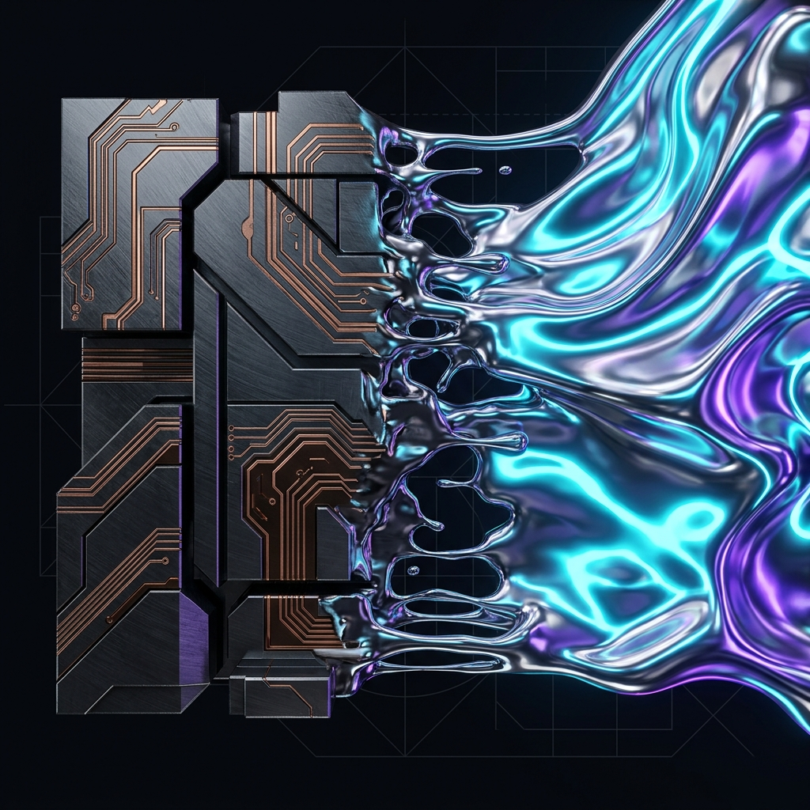

# FerroUI Interactive Demo — System / Generation Prompt

> **Purpose:** This document serves as the authoritative generation prompt for building the FerroUI interactive demo. It encodes every visual, interaction, and technical requirement so that AI-assisted generation can produce a pixel-precise, production-grade result.

### 🎨 Theme Reference



> The image above is the **visual north star**. Left: rigid, angular gunmetal hardware with glowing amber/copper circuit traces. Center: chrome-mercury morphing transition zone. Right: flowing liquid-mercury AI fluid with dominant cyan luminescence and purple undertone glow. Background: near-black with faint geometric blueprint grid.

---

## 1. Role & Objective

You are an expert frontend engineer building an interactive **React / Tailwind CSS** demo for **"FerroUI"** — a Server-Driven UI meta-framework. The goal is to simulate an AI-orchestrated runtime where the UI is **synthesized on demand**, utilizing a highly specific, dual-themed cybernetic aesthetic.

---

## 2. Visual Identity & Theming (Crucial)

The UI must reflect a deliberate transition from **"Rigid Cyber-Hardware"** to **"Fluid AI Energy."** Every visual decision must reinforce this duality. **Refer to the theme reference image above as the authoritative visual guide.**

### 2.1 Background

| Property | Value |
|----------|-------|
| Base color | Deep space black `#050505` |
| Overlay | Faint, low-opacity technical blueprint / grid pattern — thin, dark grey geometric lines (`rgba(255,255,255,0.03)` to `rgba(255,255,255,0.06)`) |
| Effect | The grid should feel like looking at a deactivated circuit board — dormant, waiting to be energized |
| Grid style | Rectangular subdivisions (not dots, not hex) — like a PCB schematic. Lines at `rgba(255,255,255,0.04)` with occasional thicker intersection nodes at `rgba(255,255,255,0.07)` |

### 2.2 Color Palette — "The Hardware" (Structural)

Structural elements — panels, cards, headers, skeletons — use the metallic, industrial palette visible on the **left side** of the reference image.

| Token | Role | Value / Tailwind | Image Reference |
|-------|------|------------------|-----------------|
| `--hw-surface` | Card / panel backgrounds | Metallic dark grey `#0D0D0F` → `#141418` gradient | The dark gunmetal body of the hardware forms |
| `--hw-surface-bevel` | Edge highlight on cards | `#1A1A20` — subtle lighter edge to simulate 3D bevel | Visible edge catches on the angular metal blocks |
| `--hw-border` | Structural borders | `border-orange-700/50` | The warm-toned edges of each metal block |
| `--hw-accent` | Typography, highlights | Warm amber-copper `#D97706` (`text-amber-600`) | The glowing circuit traces — more amber than orange |
| `--hw-accent-bright` | Active/emphasized traces | `#F59E0B` (`text-amber-500`) | The brightest illuminated trace segments |
| `--hw-trace` | Circuit trace decoration | `#92400E` at 30% opacity — thin illuminated lines | The zig-zag PCB-style trace paths |
| `--hw-muted` | Secondary text | `text-neutral-500` | — |

> **Texture note:** Card backgrounds should carry a faint brushed-steel noise texture (CSS `background-image` with a fine-grain noise overlay at `opacity: 0.04`). The hardware side has visible **angular bevels** — cards should use `box-shadow: inset 1px 1px 0 rgba(255,255,255,0.05), inset -1px -1px 0 rgba(0,0,0,0.3)` for the machined-edge feel.

### 2.3 Color Palette — "The Transition Zone" (Chrome-Mercury Bridge)

The **center** of the reference image shows a critical morphing zone where rigid metal dissolves into fluid energy. UI elements in transitional states (skeleton → rendered, orb → input) should reference this palette.

| Token | Role | Value / CSS |
|-------|------|-------------|
| `--tz-chrome` | Chrome-mercury midtone | `#A8B2C0` — cool metallic silver |
| `--tz-chrome-bright` | Reflective highlight | `#D4DBE5` — bright chrome catch |
| `--tz-gradient` | Metal-to-fluid blend | `linear-gradient(135deg, #1A1A20, #0A2A3A, #003333)` |

### 2.4 Color Palette — "The AI" (Fluid / Interactive)

Interactive and AI-driven elements use the liquid-mercury, neon-energy palette visible on the **right side** of the reference image. Note: **cyan is dominant**, purple is an **undertone/accent glow** — not an equal partner.

| Token | Role | Value / CSS | Image Reference |
|-------|------|-------------|-----------------|
| `--ai-cyan` | Primary neon (dominant) | `#00FFFF` | The main luminous color of the flowing fluid |
| `--ai-cyan-bright` | Peak luminosity | `#80FFFF` — lighter cyan for glossy highlights | The brightest reflective catches on the fluid surface |
| `--ai-purple` | Undertone/accent glow | `#B000FF` | The subtle purple tinting in the fluid's deeper folds  |
| `--ai-gradient` | Combined energy flow | `linear-gradient(135deg, #00FFFF 0%, #40E0FF 40%, #B000FF 100%)` | Cyan-dominated with purple arriving at the edges |
| `--ai-glow` | Box-shadow aura | `0 0 30px rgba(0,255,255,0.2), 0 0 60px rgba(176,0,255,0.08)` | The ambient light cast by the fluid |
| `--ai-surface` | Glassy panels | `rgba(0,255,255,0.03)` with `backdrop-blur-xl` | The translucent, refractive quality of the fluid body |
| `--ai-reflection` | Specular highlight | `rgba(255,255,255,0.12)` — white sheen on glassy surfaces | The chrome-like reflections on the fluid surface |

### 2.5 Animation & Texture Rules

| Element Type | Motion Style | Implementation |
|--------------|-------------|----------------|
| **Structural (Hardware)** | Rigid, snap-in | Framer Motion `type: "tween"`, `ease: [0.22, 1, 0.36, 1]`, short durations (200–300ms). Elements should feel **heavy** — no bounce, no overshoot. |
| **AI / Interactive** | Fluid, organic, glassy | Framer Motion `type: "spring"`, `stiffness: 200`, `damping: 25`; heavy `backdrop-blur` and gradient-borders. Should feel like **liquid mercury flowing**. |
| **Transition zone** | Morphing, dissolving | Crossfade with scale: hardware element fades while subtly scaling down, AI element fades in while scaling up. 300–400ms overlap. |
| **Skeleton scan** | Copper laser sweep | CSS `@keyframes` — horizontal gradient sweep using `--hw-accent-bright` at low opacity, moving L→R at 1.5s intervals |
| **Agent orb** | Pulsing, swirling | CSS `conic-gradient` with animated `rotate` + radial gradient overlay for depth. Subtle `scale(1.0 ↔ 1.06)` breathing at 2s period. The orb should look like a **glossy liquid droplet**, not flat. |
| **Circuit traces** | Energizing pulse | After synthesis, faint amber pulse travels along decorative trace paths on cards (CSS animated gradient position) |

---

## 3. Core Components & Initial State

### 3.1 The Canvas (Root)

- Full-screen `<Dashboard />` component
- **Initial state:** Empty — displays only the dark blueprint grid background
- No panels, no widgets, no data — just the dormant grid
- Z-index layering: grid `z-0`, content `z-10`, agent widget `z-50`

### 3.2 The Agent Widget

A **draggable, floating UI element** anchored at the bottom center of the viewport.

| State | Visual |
|-------|--------|
| **Collapsed (initial)** | Pulsing, liquid-mercury orb — a swirling, glossy sphere of cyan and purple gradients with a glassmorphism shell. Approximately `64×64px`. Soft breathing scale animation (`1.0 → 1.06 → 1.0` at `2s` ease-in-out loop). |
| **Expanded** | Wide, pill-shaped input field (`~520px` wide). Retains glossy, translucent dark background (`rgba(10,10,15,0.85)`) with fluid cyan/purple glowing border. |

**Draggability:** Use `framer-motion`'s `drag` prop with `dragConstraints` bound to the viewport. Persist position across state changes.

---

## 4. Interaction Flow — "The Golden Path"

This is the primary demonstration sequence. Every state transition must be visually distinct and narratively coherent.

### Phase 0 — Idle

- Canvas shows empty blueprint grid
- Agent orb pulses at bottom center
- No other UI elements visible

### Phase 1 — Expand

**Trigger:** User clicks the agent orb.

**Animation:**
- The orb smoothly **morphs** into a wide pill-shaped input field
- Use Framer Motion `layoutId` for seamless shared-layout animation
- Input field appears with a text cursor blinking in cyan (`#00FFFF`)
- The glossy border subtly animates as a rotating gradient

### Phase 2 — Input

**Content:** User types:
```
Run a full diagnostic on the proxy server cluster and show active connections.
```

- Monospace font for the input text (`font-mono`, `text-sm`)
- Characters appear with a subtle per-character fade-in (optional enhancement)
- Submit via `Enter` key or a small send icon (`lucide-react: SendHorizonal`)

### Phase 3 — Loading / Data Gathering (Skeletons)

**Trigger:** User presses Enter.

**Sequence:**
1. Input field **pulses** once (scale `1.0 → 1.02 → 1.0`, 200ms)
2. Input text fades to `opacity: 0.5` and becomes read-only
3. Canvas begins **streaming** skeleton components into their grid positions

**Skeleton Aesthetics (CRITICAL — "Hardware" theme):**
- Skeletons are **NOT** fluid or soft
- They look like **rigid, angular metallic block outlines** with sharp corners matching the Hardware card shape
- Each skeleton has a **copper/orange scanning laser effect** — a horizontal gradient sweep moving left-to-right continuously
- Skeleton borders: `border border-orange-700/30`
- Skeleton fill: `bg-neutral-900/60`
- Staggered entrance: each skeleton appears **80–120ms** after the previous one, snapping into place rigidly (`type: "tween"`, no spring)

### Phase 4 — Synthesis / UI Rendering

**Trigger:** After **1.5 seconds** from skeleton appearance.

**Sequence:**
1. Each skeleton **snaps** into its fully rendered Organism component
2. Transition: skeleton fades out (`opacity: 1 → 0`, 150ms) while the real component fades in (`opacity: 0 → 1`, 200ms) — slight overlap for smoothness
3. Data populates with a subtle typewriter / count-up effect for numerical values
4. Once all components are rendered, the agent input field **collapses** back to the orb (reverse morph)

---

## 5. Component Registry — The Final Layout

After synthesis completes, the dashboard displays three organism components in a responsive grid:

```
┌─────────────────────┐ ┌──────────────┐
│     KPIBoard        │ │  ChartPanel  │
│  (3 metric cards)   │ │  (line chart) │
├─────────────────────┴─┴──────────────┤
│              DataTable               │
│       (proxy connections list)       │
└──────────────────────────────────────┘
```

**Grid:** `grid grid-cols-3 gap-4` — KPIBoard spans `col-span-2`, ChartPanel `col-span-1`, DataTable `col-span-3`.

---

### 5.1 KPIBoard (Top Left — `col-span-2`)

Three metric cards displayed in a horizontal row.

#### Card Design — "Hardware" Aesthetic

| Property | Value |
|----------|-------|
| Corners | Asymmetric: `rounded-br-xl rounded-tl-xl rounded-tr-sm rounded-bl-sm` |
| Background | Dark metallic `bg-[#0D0D0F]` with brushed-steel noise overlay |
| Border | `border border-orange-700/40` |
| Typography | Copper-colored headings `text-orange-500`, values in `text-neutral-100` |
| Icons | `lucide-react` — `Cpu`, `MemoryStick`, `Network` in `text-orange-400` |

#### Mock Data

| Metric | Value | Trend |
|--------|-------|-------|
| CPU Load | 73.2% | ↑ 2.1% |
| Memory Usage | 12.4 / 16 GB | Stable |
| Network I/O | 842 Mbps | ↓ 5.3% |

- Values animate in via count-up from `0` to final value (500ms, ease-out)
- Trend indicator: green `text-emerald-400` for down, amber `text-amber-400` for up, neutral `text-neutral-500` for stable

---

### 5.2 DataTable (Bottom — `col-span-3`)

A list of active proxy connections using the **bridged** aesthetic (Hardware structure + AI hover accents).

#### Table Design

| Property | Value |
|----------|-------|
| Header | `bg-[#0A0A0C]`, `text-orange-400/80` labels, subtle `border-b border-orange-700/30` |
| Rows | `bg-transparent`, alternating `bg-white/[0.02]` for readability |
| Hover | Faint cyan glow: `hover:bg-cyan-500/[0.04]` — bridges the two themes |
| Text | `text-neutral-300` for data, `text-neutral-500` for secondary info |
| Status badges | Online: `bg-emerald-500/20 text-emerald-400`, Degraded: `bg-amber-500/20 text-amber-400`, Offline: `bg-red-500/20 text-red-400` |

#### Mock Data — Proxy Connections

| Proxy ID | Origin | Destination | Latency | Status | Uptime |
|----------|--------|-------------|---------|--------|--------|
| PXY-001 | us-east-1 | eu-west-2 | 42ms | Online | 99.97% |
| PXY-002 | ap-south-1 | us-west-1 | 187ms | Degraded | 98.12% |
| PXY-003 | eu-central-1 | ap-east-1 | 91ms | Online | 99.84% |
| PXY-004 | us-west-2 | sa-east-1 | 203ms | Offline | 0% |
| PXY-005 | eu-north-1 | us-east-2 | 38ms | Online | 99.99% |

---

### 5.3 ChartPanel (Top Right — `col-span-1`)

A glowing line chart simulating network traffic over time.

#### Chart Design

| Property | Value |
|----------|-------|
| Chart type | Animated line chart (canvas-based or SVG) |
| Line style | Fluid `stroke` with gradient: cyan `#00FFFF` → purple `#B000FF` — represents "AI Energy" flowing through "Hardware" |
| Line width | `2px` with a soft glow shadow (`filter: drop-shadow(0 0 6px rgba(0,255,255,0.4))`) |
| Fill area | Gradient fill under the line to `transparent`, at `opacity: 0.08` |
| Grid lines | Very subtle `stroke-neutral-800` |
| Axes | `text-neutral-600`, `text-xs` |
| Background | Same Hardware card aesthetic as KPIBoard |
| Title | "Network Traffic" in `text-orange-500` |

#### Mock Data — Time Series (Last 12 Points)

```
[340, 420, 380, 510, 620, 580, 720, 690, 810, 780, 842, 800]
```

- The line should animate in by **drawing** from left to right (SVG `stroke-dasharray` / `stroke-dashoffset` animation, 1.2s ease-out)
- After initial draw, the line subtly **breathes** — a gentle opacity oscillation on the glow

---

## 6. Technical Constraints

### 6.1 Dependencies

| Package | Purpose |
|---------|---------|
| `react` / `react-dom` | Core UI |
| `framer-motion` | All animations, layout transitions, drag |
| `lucide-react` | Minimalist technical icons |
| `tailwindcss` | All styling via utility classes |

> **No charting libraries.** The ChartPanel line chart must be implemented with raw SVG or Canvas and styled with Tailwind + inline styles.

### 6.2 State Simulation

All data streaming and phase transitions must be simulated using `setTimeout` and React state (`useState` / `useReducer`).

```
User presses Enter
  → [0ms]    Phase 3 begins: skeletons stream in (staggered 80-120ms each)
  → [1500ms] Phase 4 begins: skeletons → real components (staggered 200ms each)
  → [2500ms] All components rendered, agent collapses to orb
```

### 6.3 Coding Standards

- **TypeScript** — strict mode, no `any`
- **Component architecture** — each organism (`KPIBoard`, `DataTable`, `ChartPanel`, `AgentWidget`) in its own file
- **Tailwind only** — no inline styles except where CSS custom properties or SVG attributes require them
- **Framer Motion** for all motion — no raw CSS transitions on React components
- **`lucide-react`** for all icons — no emoji, no FontAwesome, no custom SVGs for icons
- **Accessibility** — all interactive elements have `aria-label`, focus-visible states, keyboard navigation for the agent input
- **Reduced motion** — respect `prefers-reduced-motion`: disable oscillating/breathing animations, keep functional transitions

### 6.4 Responsive Behavior

| Breakpoint | Layout |
|------------|--------|
| `≥1024px` | 3-column grid as specified |
| `768–1023px` | 2-column: KPIBoard full-width, ChartPanel + DataTable side-by-side |
| `<768px` | Single column stack: KPIBoard → ChartPanel → DataTable |

Agent widget remains bottom-center fixed on all breakpoints.

---

## 7. File Structure

```
demo/
├── spec.md                    ← This file
└── src/
    ├── App.tsx                ← Root: canvas grid + phase orchestrator
    ├── index.css              ← Tailwind directives + custom properties + keyframes
    ├── components/
    │   ├── AgentWidget.tsx     ← Draggable orb ↔ input morph
    │   ├── KPIBoard.tsx        ← 3× metric cards
    │   ├── KPICard.tsx         ← Individual metric card
    │   ├── DataTable.tsx       ← Proxy connections table
    │   ├── ChartPanel.tsx      ← SVG line chart
    │   ├── Skeleton.tsx        ← Hardware-style skeleton with laser sweep
    │   └── BlueprintGrid.tsx   ← Background grid pattern
    ├── hooks/
    │   ├── usePhaseOrchestrator.ts  ← Phase state machine (idle → expand → input → loading → synthesis → complete)
    │   └── useCountUp.ts            ← Animated number counter
    ├── data/
    │   └── mockData.ts         ← All mock data constants
    └── types/
        └── index.ts            ← Shared TypeScript types
```

---

## 8. Success Criteria

- [ ] Initial canvas renders as an empty, dark blueprint grid — no content visible
- [ ] Agent orb pulses with liquid-mercury aesthetic (cyan/purple swirl + glassmorphism)
- [ ] Click-to-expand morph is seamless via Framer Motion `layoutId`
- [ ] Skeletons stream in with rigid, metallic aesthetics and copper laser sweep
- [ ] Phase 3 → Phase 4 transition is clearly visible (1.5s gap between skeletons and real data)
- [ ] KPIBoard cards use asymmetric corner radius and copper typography
- [ ] DataTable rows have cyan hover glow bridging the two themes
- [ ] ChartPanel line draws in with cyan-to-purple gradient and soft glow
- [ ] All numerical values animate via count-up effect
- [ ] Agent collapses back to orb after synthesis completes
- [ ] No TypeScript errors (`tsc --noEmit`)
- [ ] Passes `eslint --max-warnings 0`
- [ ] Respects `prefers-reduced-motion`
- [ ] Responsive across 3 breakpoints (mobile / tablet / desktop)
- [ ] All icons sourced from `lucide-react` — zero emoji usage
