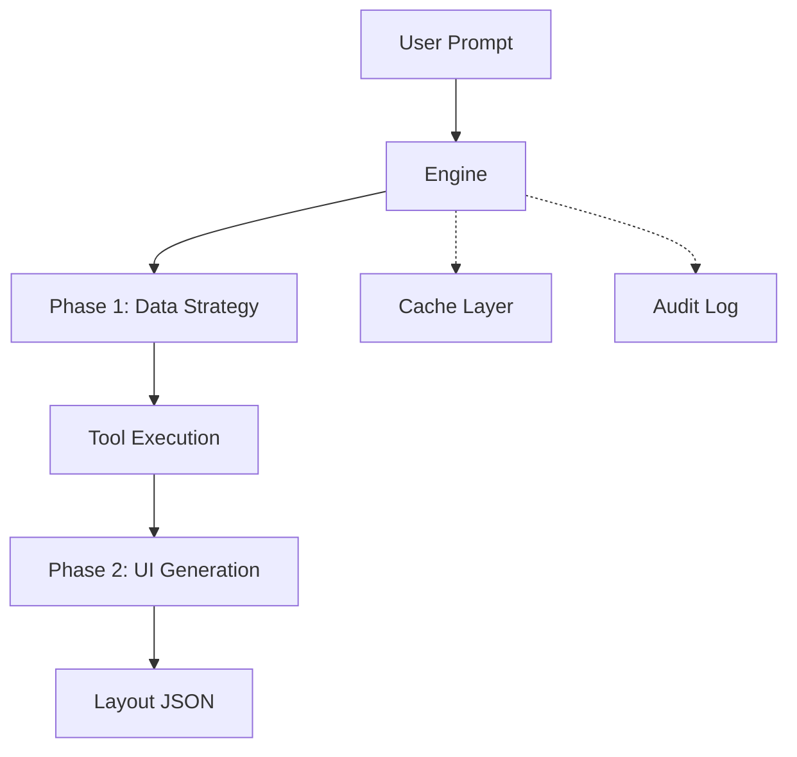

[**Documentation**](../README.md)

***

# @ferroui/engine

The Orchestration Engine is the brain of FerroUI. It translates user prompts into high-fidelity layout JSON using a Dual-Phase Pipeline powered by Large Language Models (LLMs).

## Architecture



## Features

- **Dual-Phase Pipeline**: Separates data retrieval from UI generation for maximum reliability.
- **Provider-Agnostic**: Supports OpenAI, Anthropic, Google, Ollama, and more.
- **Auto-Repair**: Automatically attempts to fix invalid layouts during generation.
- **OpenTelemetry**: Integrated tracing for every stage of the pipeline.

## Installation

```bash
pnpm add @ferroui/engine
```

## Usage

### Creating an Engine Instance

```typescript
import { FerroUIEngine } from '@ferroui/engine';
import { OpenAIProvider } from '@ferroui/engine/providers/openai';

const provider = new OpenAIProvider({ apiKey: process.env.OPENAI_API_KEY });
const engine = new FerroUIEngine(provider);
```

### Processing a Prompt

```typescript
const prompt = "Show me a sales dashboard";
const context = { userId: '123', requestId: 'req-456', locale: 'en-US' };

for await (const chunk of engine.process(prompt, context)) {
  if (chunk.type === 'layout_chunk') {
    console.log('Received layout:', chunk.layout);
  }
}
```

## Configuration

- `maxRepairAttempts`: Number of times the engine tries to fix an invalid layout (default: 3).
- `cacheEnabled`: Whether to cache engine results (default: true).
- `toolTimeoutMs`: Timeout for backend tool execution (default: 3000ms).

## API Reference

- `FerroUIEngine`: Main orchestration class.
- `LlmProvider`: Abstract base class for LLM providers.
- `runDualPhasePipeline`: The core processing function.

## Classes

### AnthropicProvider

Defined in: [engine/src/providers/anthropic.ts:26](https://github.com/jxoesneon/FerroUI/blob/f629cfe8aad65aa35e0bd2ea86f61d378dcad807/packages/engine/src/providers/anthropic.ts#L26)

#### Implements

- [`LlmProvider`](#llmprovider)

#### Constructors

##### Constructor

> **new AnthropicProvider**(`options?`): [`AnthropicProvider`](#anthropicprovider)

Defined in: [engine/src/providers/anthropic.ts:32](https://github.com/jxoesneon/FerroUI/blob/f629cfe8aad65aa35e0bd2ea86f61d378dcad807/packages/engine/src/providers/anthropic.ts#L32)

###### Parameters

###### options?

`AnthropicProviderOptions` = `{}`

###### Returns

[`AnthropicProvider`](#anthropicprovider)

#### Properties

##### contextWindowTokens

> `readonly` **contextWindowTokens**: `200000` = `200000`

Defined in: [engine/src/providers/anthropic.ts:28](https://github.com/jxoesneon/FerroUI/blob/f629cfe8aad65aa35e0bd2ea86f61d378dcad807/packages/engine/src/providers/anthropic.ts#L28)

###### Implementation of

[`LlmProvider`](#llmprovider).[`contextWindowTokens`](#contextwindowtokens-4)

##### id

> `readonly` **id**: `"anthropic"` = `'anthropic'`

Defined in: [engine/src/providers/anthropic.ts:27](https://github.com/jxoesneon/FerroUI/blob/f629cfe8aad65aa35e0bd2ea86f61d378dcad807/packages/engine/src/providers/anthropic.ts#L27)

###### Implementation of

[`LlmProvider`](#llmprovider).[`id`](#id-4)

#### Methods

##### completePrompt()

> **completePrompt**(`req`): `Promise`\<[`LlmResponse`](#llmresponse)\>

Defined in: [engine/src/providers/anthropic.ts:117](https://github.com/jxoesneon/FerroUI/blob/f629cfe8aad65aa35e0bd2ea86f61d378dcad807/packages/engine/src/providers/anthropic.ts#L117)

Non-streaming version for simpler tasks like repair or small data generation.

###### Parameters

###### req

[`LlmRequest`](#llmrequest)

###### Returns

`Promise`\<[`LlmResponse`](#llmresponse)\>

###### Implementation of

[`LlmProvider`](#llmprovider).[`completePrompt`](#completeprompt-4)

##### estimateTokens()

> **estimateTokens**(`text`): `number`

Defined in: [engine/src/providers/anthropic.ts:169](https://github.com/jxoesneon/FerroUI/blob/f629cfe8aad65aa35e0bd2ea86f61d378dcad807/packages/engine/src/providers/anthropic.ts#L169)

Estimates tokens for a given text.

###### Parameters

###### text

`string`

###### Returns

`number`

###### Implementation of

[`LlmProvider`](#llmprovider).[`estimateTokens`](#estimatetokens-4)

##### processPrompt()

> **processPrompt**(`req`): `AsyncGenerator`\<`string`, [`LlmResponse`](#llmresponse), `undefined`\>

Defined in: [engine/src/providers/anthropic.ts:54](https://github.com/jxoesneon/FerroUI/blob/f629cfe8aad65aa35e0bd2ea86f61d378dcad807/packages/engine/src/providers/anthropic.ts#L54)

Processes a prompt and returns an AsyncGenerator for streaming content.
Yields content chunks and eventually returns the final response object.

###### Parameters

###### req

[`LlmRequest`](#llmrequest)

###### Returns

`AsyncGenerator`\<`string`, [`LlmResponse`](#llmresponse), `undefined`\>

###### Implementation of

[`LlmProvider`](#llmprovider).[`processPrompt`](#processprompt-4)

***

### FerroUIEngine

Defined in: [engine/src/engine.ts:14](https://github.com/jxoesneon/FerroUI/blob/f629cfe8aad65aa35e0bd2ea86f61d378dcad807/packages/engine/src/engine.ts#L14)

#### Constructors

##### Constructor

> **new FerroUIEngine**(`provider`, `config?`): [`FerroUIEngine`](#ferrouiengine)

Defined in: [engine/src/engine.ts:18](https://github.com/jxoesneon/FerroUI/blob/f629cfe8aad65aa35e0bd2ea86f61d378dcad807/packages/engine/src/engine.ts#L18)

###### Parameters

###### provider

[`LlmProvider`](#llmprovider)

###### config?

`Partial`\<[`EngineConfig`](#engineconfig)\>

###### Returns

[`FerroUIEngine`](#ferrouiengine)

#### Methods

##### process()

> **process**(`prompt`, `context`): `AsyncGenerator`\<[`EngineChunk`](#enginechunk), `void`, `undefined`\>

Defined in: [engine/src/engine.ts:81](https://github.com/jxoesneon/FerroUI/blob/f629cfe8aad65aa35e0bd2ea86f61d378dcad807/packages/engine/src/engine.ts#L81)

Main entry point for the FerroUI engine.
Processes a user prompt through the Dual-Phase Pipeline.

###### Parameters

###### prompt

`string`

###### context

[`RequestContext`](#requestcontext)

###### Returns

`AsyncGenerator`\<[`EngineChunk`](#enginechunk), `void`, `undefined`\>

##### setProvider()

> **setProvider**(`provider`): `void`

Defined in: [engine/src/engine.ts:156](https://github.com/jxoesneon/FerroUI/blob/f629cfe8aad65aa35e0bd2ea86f61d378dcad807/packages/engine/src/engine.ts#L156)

###### Parameters

###### provider

[`LlmProvider`](#llmprovider)

###### Returns

`void`

##### updateConfig()

> **updateConfig**(`config`): `void`

Defined in: [engine/src/engine.ts:160](https://github.com/jxoesneon/FerroUI/blob/f629cfe8aad65aa35e0bd2ea86f61d378dcad807/packages/engine/src/engine.ts#L160)

###### Parameters

###### config

`Partial`\<[`EngineConfig`](#engineconfig)\>

###### Returns

`void`

***

### GoogleProvider

Defined in: [engine/src/providers/google.ts:10](https://github.com/jxoesneon/FerroUI/blob/f629cfe8aad65aa35e0bd2ea86f61d378dcad807/packages/engine/src/providers/google.ts#L10)

#### Implements

- [`LlmProvider`](#llmprovider)

#### Constructors

##### Constructor

> **new GoogleProvider**(`options?`): [`GoogleProvider`](#googleprovider)

Defined in: [engine/src/providers/google.ts:16](https://github.com/jxoesneon/FerroUI/blob/f629cfe8aad65aa35e0bd2ea86f61d378dcad807/packages/engine/src/providers/google.ts#L16)

###### Parameters

###### options?

`GoogleProviderOptions` = `{}`

###### Returns

[`GoogleProvider`](#googleprovider)

#### Properties

##### contextWindowTokens

> `readonly` **contextWindowTokens**: `1000000` = `1000000`

Defined in: [engine/src/providers/google.ts:12](https://github.com/jxoesneon/FerroUI/blob/f629cfe8aad65aa35e0bd2ea86f61d378dcad807/packages/engine/src/providers/google.ts#L12)

###### Implementation of

[`LlmProvider`](#llmprovider).[`contextWindowTokens`](#contextwindowtokens-4)

##### id

> `readonly` **id**: `"google"` = `'google'`

Defined in: [engine/src/providers/google.ts:11](https://github.com/jxoesneon/FerroUI/blob/f629cfe8aad65aa35e0bd2ea86f61d378dcad807/packages/engine/src/providers/google.ts#L11)

###### Implementation of

[`LlmProvider`](#llmprovider).[`id`](#id-4)

#### Methods

##### completePrompt()

> **completePrompt**(`req`): `Promise`\<[`LlmResponse`](#llmresponse)\>

Defined in: [engine/src/providers/google.ts:54](https://github.com/jxoesneon/FerroUI/blob/f629cfe8aad65aa35e0bd2ea86f61d378dcad807/packages/engine/src/providers/google.ts#L54)

Non-streaming version for simpler tasks like repair or small data generation.

###### Parameters

###### req

[`LlmRequest`](#llmrequest)

###### Returns

`Promise`\<[`LlmResponse`](#llmresponse)\>

###### Implementation of

[`LlmProvider`](#llmprovider).[`completePrompt`](#completeprompt-4)

##### estimateTokens()

> **estimateTokens**(`text`): `number`

Defined in: [engine/src/providers/google.ts:80](https://github.com/jxoesneon/FerroUI/blob/f629cfe8aad65aa35e0bd2ea86f61d378dcad807/packages/engine/src/providers/google.ts#L80)

Estimates tokens for a given text.

###### Parameters

###### text

`string`

###### Returns

`number`

###### Implementation of

[`LlmProvider`](#llmprovider).[`estimateTokens`](#estimatetokens-4)

##### processPrompt()

> **processPrompt**(`req`): `AsyncGenerator`\<`string`, [`LlmResponse`](#llmresponse), `undefined`\>

Defined in: [engine/src/providers/google.ts:21](https://github.com/jxoesneon/FerroUI/blob/f629cfe8aad65aa35e0bd2ea86f61d378dcad807/packages/engine/src/providers/google.ts#L21)

Processes a prompt and returns an AsyncGenerator for streaming content.
Yields content chunks and eventually returns the final response object.

###### Parameters

###### req

[`LlmRequest`](#llmrequest)

###### Returns

`AsyncGenerator`\<`string`, [`LlmResponse`](#llmresponse), `undefined`\>

###### Implementation of

[`LlmProvider`](#llmprovider).[`processPrompt`](#processprompt-4)

***

### OllamaProvider

Defined in: [engine/src/providers/ollama.ts:17](https://github.com/jxoesneon/FerroUI/blob/f629cfe8aad65aa35e0bd2ea86f61d378dcad807/packages/engine/src/providers/ollama.ts#L17)

#### Implements

- [`LlmProvider`](#llmprovider)

#### Constructors

##### Constructor

> **new OllamaProvider**(`options?`): [`OllamaProvider`](#ollamaprovider)

Defined in: [engine/src/providers/ollama.ts:23](https://github.com/jxoesneon/FerroUI/blob/f629cfe8aad65aa35e0bd2ea86f61d378dcad807/packages/engine/src/providers/ollama.ts#L23)

###### Parameters

###### options?

`OllamaProviderOptions` = `{}`

###### Returns

[`OllamaProvider`](#ollamaprovider)

#### Properties

##### contextWindowTokens

> `readonly` **contextWindowTokens**: `128000` = `128000`

Defined in: [engine/src/providers/ollama.ts:19](https://github.com/jxoesneon/FerroUI/blob/f629cfe8aad65aa35e0bd2ea86f61d378dcad807/packages/engine/src/providers/ollama.ts#L19)

###### Implementation of

[`LlmProvider`](#llmprovider).[`contextWindowTokens`](#contextwindowtokens-4)

##### id

> `readonly` **id**: `"ollama"` = `'ollama'`

Defined in: [engine/src/providers/ollama.ts:18](https://github.com/jxoesneon/FerroUI/blob/f629cfe8aad65aa35e0bd2ea86f61d378dcad807/packages/engine/src/providers/ollama.ts#L18)

###### Implementation of

[`LlmProvider`](#llmprovider).[`id`](#id-4)

#### Methods

##### completePrompt()

> **completePrompt**(`req`): `Promise`\<[`LlmResponse`](#llmresponse)\>

Defined in: [engine/src/providers/ollama.ts:78](https://github.com/jxoesneon/FerroUI/blob/f629cfe8aad65aa35e0bd2ea86f61d378dcad807/packages/engine/src/providers/ollama.ts#L78)

Non-streaming version for simpler tasks like repair or small data generation.

###### Parameters

###### req

[`LlmRequest`](#llmrequest)

###### Returns

`Promise`\<[`LlmResponse`](#llmresponse)\>

###### Implementation of

[`LlmProvider`](#llmprovider).[`completePrompt`](#completeprompt-4)

##### estimateTokens()

> **estimateTokens**(`text`): `number`

Defined in: [engine/src/providers/ollama.ts:105](https://github.com/jxoesneon/FerroUI/blob/f629cfe8aad65aa35e0bd2ea86f61d378dcad807/packages/engine/src/providers/ollama.ts#L105)

Estimates tokens for a given text.

###### Parameters

###### text

`string`

###### Returns

`number`

###### Implementation of

[`LlmProvider`](#llmprovider).[`estimateTokens`](#estimatetokens-4)

##### processPrompt()

> **processPrompt**(`req`): `AsyncGenerator`\<`string`, [`LlmResponse`](#llmresponse), `undefined`\>

Defined in: [engine/src/providers/ollama.ts:28](https://github.com/jxoesneon/FerroUI/blob/f629cfe8aad65aa35e0bd2ea86f61d378dcad807/packages/engine/src/providers/ollama.ts#L28)

Processes a prompt and returns an AsyncGenerator for streaming content.
Yields content chunks and eventually returns the final response object.

###### Parameters

###### req

[`LlmRequest`](#llmrequest)

###### Returns

`AsyncGenerator`\<`string`, [`LlmResponse`](#llmresponse), `undefined`\>

###### Implementation of

[`LlmProvider`](#llmprovider).[`processPrompt`](#processprompt-4)

***

### OpenAIProvider

Defined in: [engine/src/providers/openai.ts:11](https://github.com/jxoesneon/FerroUI/blob/f629cfe8aad65aa35e0bd2ea86f61d378dcad807/packages/engine/src/providers/openai.ts#L11)

#### Implements

- [`LlmProvider`](#llmprovider)

#### Constructors

##### Constructor

> **new OpenAIProvider**(`options?`): [`OpenAIProvider`](#openaiprovider)

Defined in: [engine/src/providers/openai.ts:17](https://github.com/jxoesneon/FerroUI/blob/f629cfe8aad65aa35e0bd2ea86f61d378dcad807/packages/engine/src/providers/openai.ts#L17)

###### Parameters

###### options?

`OpenAIProviderOptions` = `{}`

###### Returns

[`OpenAIProvider`](#openaiprovider)

#### Properties

##### contextWindowTokens

> `readonly` **contextWindowTokens**: `128000` = `128000`

Defined in: [engine/src/providers/openai.ts:13](https://github.com/jxoesneon/FerroUI/blob/f629cfe8aad65aa35e0bd2ea86f61d378dcad807/packages/engine/src/providers/openai.ts#L13)

###### Implementation of

[`LlmProvider`](#llmprovider).[`contextWindowTokens`](#contextwindowtokens-4)

##### id

> `readonly` **id**: `"openai"` = `'openai'`

Defined in: [engine/src/providers/openai.ts:12](https://github.com/jxoesneon/FerroUI/blob/f629cfe8aad65aa35e0bd2ea86f61d378dcad807/packages/engine/src/providers/openai.ts#L12)

###### Implementation of

[`LlmProvider`](#llmprovider).[`id`](#id-4)

#### Methods

##### completePrompt()

> **completePrompt**(`req`): `Promise`\<[`LlmResponse`](#llmresponse)\>

Defined in: [engine/src/providers/openai.ts:58](https://github.com/jxoesneon/FerroUI/blob/f629cfe8aad65aa35e0bd2ea86f61d378dcad807/packages/engine/src/providers/openai.ts#L58)

Non-streaming version for simpler tasks like repair or small data generation.

###### Parameters

###### req

[`LlmRequest`](#llmrequest)

###### Returns

`Promise`\<[`LlmResponse`](#llmresponse)\>

###### Implementation of

[`LlmProvider`](#llmprovider).[`completePrompt`](#completeprompt-4)

##### estimateTokens()

> **estimateTokens**(`text`): `number`

Defined in: [engine/src/providers/openai.ts:83](https://github.com/jxoesneon/FerroUI/blob/f629cfe8aad65aa35e0bd2ea86f61d378dcad807/packages/engine/src/providers/openai.ts#L83)

Estimates tokens for a given text.

###### Parameters

###### text

`string`

###### Returns

`number`

###### Implementation of

[`LlmProvider`](#llmprovider).[`estimateTokens`](#estimatetokens-4)

##### processPrompt()

> **processPrompt**(`req`): `AsyncGenerator`\<`string`, [`LlmResponse`](#llmresponse), `undefined`\>

Defined in: [engine/src/providers/openai.ts:25](https://github.com/jxoesneon/FerroUI/blob/f629cfe8aad65aa35e0bd2ea86f61d378dcad807/packages/engine/src/providers/openai.ts#L25)

Processes a prompt and returns an AsyncGenerator for streaming content.
Yields content chunks and eventually returns the final response object.

###### Parameters

###### req

[`LlmRequest`](#llmrequest)

###### Returns

`AsyncGenerator`\<`string`, [`LlmResponse`](#llmresponse), `undefined`\>

###### Implementation of

[`LlmProvider`](#llmprovider).[`processPrompt`](#processprompt-4)

## Interfaces

### EngineChunk

Defined in: [engine/src/types.ts:49](https://github.com/jxoesneon/FerroUI/blob/f629cfe8aad65aa35e0bd2ea86f61d378dcad807/packages/engine/src/types.ts#L49)

#### Properties

##### content?

> `optional` **content?**: `string`

Defined in: [engine/src/types.ts:52](https://github.com/jxoesneon/FerroUI/blob/f629cfe8aad65aa35e0bd2ea86f61d378dcad807/packages/engine/src/types.ts#L52)

##### error?

> `optional` **error?**: `object`

Defined in: [engine/src/types.ts:62](https://github.com/jxoesneon/FerroUI/blob/f629cfe8aad65aa35e0bd2ea86f61d378dcad807/packages/engine/src/types.ts#L62)

###### code

> **code**: `string`

###### message

> **message**: `string`

###### retryable

> **retryable**: `boolean`

##### layout?

> `optional` **layout?**: `Partial`\<\{ `layout`: `FerroUIComponent`; `locale`: `string`; `metadata?`: \{ `cacheHit?`: `boolean`; `generatedAt`: `string`; `latencyMs?`: `number`; `model?`: `string`; `provider?`: `string`; `repairAttempts?`: `number`; \}; `requestId`: `string`; `schemaVersion`: `string`; \}\>

Defined in: [engine/src/types.ts:61](https://github.com/jxoesneon/FerroUI/blob/f629cfe8aad65aa35e0bd2ea86f61d378dcad807/packages/engine/src/types.ts#L61)

##### phase?

> `optional` **phase?**: `1` \| `2`

Defined in: [engine/src/types.ts:51](https://github.com/jxoesneon/FerroUI/blob/f629cfe8aad65aa35e0bd2ea86f61d378dcad807/packages/engine/src/types.ts#L51)

##### toolCall?

> `optional` **toolCall?**: `object`

Defined in: [engine/src/types.ts:53](https://github.com/jxoesneon/FerroUI/blob/f629cfe8aad65aa35e0bd2ea86f61d378dcad807/packages/engine/src/types.ts#L53)

###### args

> **args**: `any`

###### name

> **name**: `string`

##### toolOutput?

> `optional` **toolOutput?**: `object`

Defined in: [engine/src/types.ts:57](https://github.com/jxoesneon/FerroUI/blob/f629cfe8aad65aa35e0bd2ea86f61d378dcad807/packages/engine/src/types.ts#L57)

###### name

> **name**: `string`

###### result

> **result**: `any`

##### type

> **type**: `"phase"` \| `"tool_call"` \| `"tool_output"` \| `"layout_chunk"` \| `"complete"` \| `"error"`

Defined in: [engine/src/types.ts:50](https://github.com/jxoesneon/FerroUI/blob/f629cfe8aad65aa35e0bd2ea86f61d378dcad807/packages/engine/src/types.ts#L50)

***

### EngineConfig

Defined in: [engine/src/types.ts:69](https://github.com/jxoesneon/FerroUI/blob/f629cfe8aad65aa35e0bd2ea86f61d378dcad807/packages/engine/src/types.ts#L69)

#### Properties

##### cacheEnabled

> **cacheEnabled**: `boolean`

Defined in: [engine/src/types.ts:71](https://github.com/jxoesneon/FerroUI/blob/f629cfe8aad65aa35e0bd2ea86f61d378dcad807/packages/engine/src/types.ts#L71)

##### maxRepairAttempts

> **maxRepairAttempts**: `number`

Defined in: [engine/src/types.ts:70](https://github.com/jxoesneon/FerroUI/blob/f629cfe8aad65aa35e0bd2ea86f61d378dcad807/packages/engine/src/types.ts#L70)

##### toolTimeoutMs

> **toolTimeoutMs**: `number`

Defined in: [engine/src/types.ts:72](https://github.com/jxoesneon/FerroUI/blob/f629cfe8aad65aa35e0bd2ea86f61d378dcad807/packages/engine/src/types.ts#L72)

***

### LlmProvider

Defined in: [engine/src/providers/base.ts:3](https://github.com/jxoesneon/FerroUI/blob/f629cfe8aad65aa35e0bd2ea86f61d378dcad807/packages/engine/src/providers/base.ts#L3)

#### Properties

##### contextWindowTokens

> `readonly` **contextWindowTokens**: `number`

Defined in: [engine/src/providers/base.ts:5](https://github.com/jxoesneon/FerroUI/blob/f629cfe8aad65aa35e0bd2ea86f61d378dcad807/packages/engine/src/providers/base.ts#L5)

##### id

> `readonly` **id**: `string`

Defined in: [engine/src/providers/base.ts:4](https://github.com/jxoesneon/FerroUI/blob/f629cfe8aad65aa35e0bd2ea86f61d378dcad807/packages/engine/src/providers/base.ts#L4)

#### Methods

##### completePrompt()

> **completePrompt**(`req`): `Promise`\<[`LlmResponse`](#llmresponse)\>

Defined in: [engine/src/providers/base.ts:16](https://github.com/jxoesneon/FerroUI/blob/f629cfe8aad65aa35e0bd2ea86f61d378dcad807/packages/engine/src/providers/base.ts#L16)

Non-streaming version for simpler tasks like repair or small data generation.

###### Parameters

###### req

[`LlmRequest`](#llmrequest)

###### Returns

`Promise`\<[`LlmResponse`](#llmresponse)\>

##### estimateTokens()

> **estimateTokens**(`text`): `number`

Defined in: [engine/src/providers/base.ts:21](https://github.com/jxoesneon/FerroUI/blob/f629cfe8aad65aa35e0bd2ea86f61d378dcad807/packages/engine/src/providers/base.ts#L21)

Estimates tokens for a given text.

###### Parameters

###### text

`string`

###### Returns

`number`

##### processPrompt()

> **processPrompt**(`req`): `AsyncGenerator`\<`string`, [`LlmResponse`](#llmresponse), `undefined`\>

Defined in: [engine/src/providers/base.ts:11](https://github.com/jxoesneon/FerroUI/blob/f629cfe8aad65aa35e0bd2ea86f61d378dcad807/packages/engine/src/providers/base.ts#L11)

Processes a prompt and returns an AsyncGenerator for streaming content.
Yields content chunks and eventually returns the final response object.

###### Parameters

###### req

[`LlmRequest`](#llmrequest)

###### Returns

`AsyncGenerator`\<`string`, [`LlmResponse`](#llmresponse), `undefined`\>

***

### LlmRequest

Defined in: [engine/src/types.ts:20](https://github.com/jxoesneon/FerroUI/blob/f629cfe8aad65aa35e0bd2ea86f61d378dcad807/packages/engine/src/types.ts#L20)

#### Properties

##### conversationContext?

> `optional` **conversationContext?**: `string`[]

Defined in: [engine/src/types.ts:23](https://github.com/jxoesneon/FerroUI/blob/f629cfe8aad65aa35e0bd2ea86f61d378dcad807/packages/engine/src/types.ts#L23)

##### enablePromptCache?

> `optional` **enablePromptCache?**: `boolean`

Defined in: [engine/src/types.ts:37](https://github.com/jxoesneon/FerroUI/blob/f629cfe8aad65aa35e0bd2ea86f61d378dcad807/packages/engine/src/types.ts#L37)

When true, marks the system prompt as a candidate for provider-level
prompt caching (Anthropic ephemeral cache / OpenAI cached prefix).

##### jsonMode?

> `optional` **jsonMode?**: `boolean`

Defined in: [engine/src/types.ts:32](https://github.com/jxoesneon/FerroUI/blob/f629cfe8aad65aa35e0bd2ea86f61d378dcad807/packages/engine/src/types.ts#L32)

When true, instructs the provider to return valid JSON only.
- OpenAI: sets response_format = { type: 'json_object' }
- Anthropic: wraps response in a structured_json tool call
- Other providers: no-op (rely on prompt instruction)

##### maxTokens?

> `optional` **maxTokens?**: `number`

Defined in: [engine/src/types.ts:25](https://github.com/jxoesneon/FerroUI/blob/f629cfe8aad65aa35e0bd2ea86f61d378dcad807/packages/engine/src/types.ts#L25)

##### systemPrompt

> **systemPrompt**: `string`

Defined in: [engine/src/types.ts:21](https://github.com/jxoesneon/FerroUI/blob/f629cfe8aad65aa35e0bd2ea86f61d378dcad807/packages/engine/src/types.ts#L21)

##### temperature?

> `optional` **temperature?**: `number`

Defined in: [engine/src/types.ts:24](https://github.com/jxoesneon/FerroUI/blob/f629cfe8aad65aa35e0bd2ea86f61d378dcad807/packages/engine/src/types.ts#L24)

##### userPrompt

> **userPrompt**: `string`

Defined in: [engine/src/types.ts:22](https://github.com/jxoesneon/FerroUI/blob/f629cfe8aad65aa35e0bd2ea86f61d378dcad807/packages/engine/src/types.ts#L22)

***

### LlmResponse

Defined in: [engine/src/types.ts:40](https://github.com/jxoesneon/FerroUI/blob/f629cfe8aad65aa35e0bd2ea86f61d378dcad807/packages/engine/src/types.ts#L40)

#### Properties

##### content

> **content**: `string`

Defined in: [engine/src/types.ts:41](https://github.com/jxoesneon/FerroUI/blob/f629cfe8aad65aa35e0bd2ea86f61d378dcad807/packages/engine/src/types.ts#L41)

##### tokens

> **tokens**: `object`

Defined in: [engine/src/types.ts:42](https://github.com/jxoesneon/FerroUI/blob/f629cfe8aad65aa35e0bd2ea86f61d378dcad807/packages/engine/src/types.ts#L42)

###### input

> **input**: `number`

###### output

> **output**: `number`

###### total

> **total**: `number`

***

### RequestContext

Defined in: [engine/src/types.ts:6](https://github.com/jxoesneon/FerroUI/blob/f629cfe8aad65aa35e0bd2ea86f61d378dcad807/packages/engine/src/types.ts#L6)

#### Properties

##### locale

> **locale**: `string`

Defined in: [engine/src/types.ts:9](https://github.com/jxoesneon/FerroUI/blob/f629cfe8aad65aa35e0bd2ea86f61d378dcad807/packages/engine/src/types.ts#L9)

##### metadata?

> `optional` **metadata?**: `Record`\<`string`, `unknown`\>

Defined in: [engine/src/types.ts:17](https://github.com/jxoesneon/FerroUI/blob/f629cfe8aad65aa35e0bd2ea86f61d378dcad807/packages/engine/src/types.ts#L17)

##### permissions

> **permissions**: `string`[]

Defined in: [engine/src/types.ts:8](https://github.com/jxoesneon/FerroUI/blob/f629cfe8aad65aa35e0bd2ea86f61d378dcad807/packages/engine/src/types.ts#L8)

##### requestId

> **requestId**: `string`

Defined in: [engine/src/types.ts:10](https://github.com/jxoesneon/FerroUI/blob/f629cfe8aad65aa35e0bd2ea86f61d378dcad807/packages/engine/src/types.ts#L10)

##### tenantId?

> `optional` **tenantId?**: `string`

Defined in: [engine/src/types.ts:16](https://github.com/jxoesneon/FerroUI/blob/f629cfe8aad65aa35e0bd2ea86f61d378dcad807/packages/engine/src/types.ts#L16)

Tenant identifier for multi-tenant deployments.
Used for per-tenant quota enforcement, audit logging, and cache namespace isolation.
Defaults to "default" when not provided.

##### userId

> **userId**: `string`

Defined in: [engine/src/types.ts:7](https://github.com/jxoesneon/FerroUI/blob/f629cfe8aad65aa35e0bd2ea86f61d378dcad807/packages/engine/src/types.ts#L7)

## Variables

### semanticCache

> `const` **semanticCache**: `SemanticCache`

Defined in: [engine/src/cache/semantic-cache.ts:233](https://github.com/jxoesneon/FerroUI/blob/f629cfe8aad65aa35e0bd2ea86f61d378dcad807/packages/engine/src/cache/semantic-cache.ts#L233)

## Functions

### createServer()

> **createServer**(`options?`): `object`

Defined in: [engine/src/server.ts:154](https://github.com/jxoesneon/FerroUI/blob/f629cfe8aad65aa35e0bd2ea86f61d378dcad807/packages/engine/src/server.ts#L154)

#### Parameters

##### options?

###### port?

`number`

###### provider?

[`LlmProvider`](#llmprovider)

#### Returns

`object`

##### app

> **app**: `Express`

##### server

> **server**: `Server`\<*typeof* `IncomingMessage`\>

***

### repairLayout()

> **repairLayout**(`provider`, `originalPrompt`, `invalidLayout`, `errors`, `context`, `attempt?`, `maxAttempts?`): `Promise`\<\{ `layout`: `FerroUIComponent`; `locale`: `string`; `metadata?`: \{ `cacheHit?`: `boolean`; `generatedAt`: `string`; `latencyMs?`: `number`; `model?`: `string`; `provider?`: `string`; `repairAttempts?`: `number`; \}; `requestId`: `string`; `schemaVersion`: `string`; \}\>

Defined in: [engine/src/validation/repair.ts:62](https://github.com/jxoesneon/FerroUI/blob/f629cfe8aad65aa35e0bd2ea86f61d378dcad807/packages/engine/src/validation/repair.ts#L62)

Self-healing repair loop

#### Parameters

##### provider

[`LlmProvider`](#llmprovider)

##### originalPrompt

`string`

##### invalidLayout

`any`

##### errors

`ValidationIssue`[]

##### context

[`RequestContext`](#requestcontext)

##### attempt?

`number` = `1`

##### maxAttempts?

`number` = `3`

#### Returns

`Promise`\<\{ `layout`: `FerroUIComponent`; `locale`: `string`; `metadata?`: \{ `cacheHit?`: `boolean`; `generatedAt`: `string`; `latencyMs?`: `number`; `model?`: `string`; `provider?`: `string`; `repairAttempts?`: `number`; \}; `requestId`: `string`; `schemaVersion`: `string`; \}\>

***

### runDualPhasePipeline()

> **runDualPhasePipeline**(`initialProvider`, `inputPrompt`, `context`, `config`): `AsyncGenerator`\<[`EngineChunk`](#enginechunk), `void`, `undefined`\>

Defined in: [engine/src/pipeline/dual-phase.ts:64](https://github.com/jxoesneon/FerroUI/blob/f629cfe8aad65aa35e0bd2ea86f61d378dcad807/packages/engine/src/pipeline/dual-phase.ts#L64)

#### Parameters

##### initialProvider

[`LlmProvider`](#llmprovider)

##### inputPrompt

`string`

##### context

[`RequestContext`](#requestcontext)

##### config

[`EngineConfig`](#engineconfig)

#### Returns

`AsyncGenerator`\<[`EngineChunk`](#enginechunk), `void`, `undefined`\>
