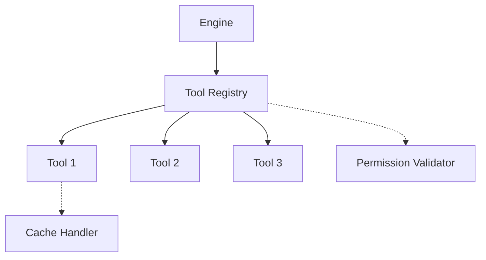

[**Documentation**](../README.md)

***

# @ferroui/tools

The Tool Registry manages backend capabilities (tools) that the FerroUI engine can use to retrieve data or perform actions during UI generation.

## Architecture



## Features

- **Zod-Powered Validation**: Parameters and return values are strictly validated.
- **Permission Checking**: Filters available tools based on user permissions.
- **Cache Management**: Supports TTL-based caching and manual invalidation.
- **Sensitive Tool Flagging**: Identifies tools that require special handling or auditing.

## Installation

```bash
pnpm add @ferroui/tools
```

## Usage

### Registering a Tool

```typescript
import { registerTool } from '@ferroui/tools';
import { z } from 'zod';

const SalesMetricsSchema = z.object({
  revenue: z.number(),
  orders: z.number()
});

registerTool({
  name: 'getSalesMetrics',
  description: 'Returns sales revenue and order counts.',
  parameters: z.object({ dateRange: z.string() }),
  returns: SalesMetricsSchema,
  execute: async ({ dateRange }) => {
    // Fetch from real backend
    return { revenue: 1000, orders: 10 };
  }
});
```

### Filtering Tools for User

```typescript
import { getToolsForUser } from '@ferroui/tools';

const userPermissions = ['sales.read', 'analytics.view'];
const manifest = getToolsForUser(userPermissions);
// manifest will only contain tools the user has permission to use.
```

## API Reference

- `ToolRegistry`: Singleton manager for tools.
- `registerTool(definition)`: Registers a new tool.
- `executeTool(name, args, context)`: Safely executes a registered tool.
- `getToolsForUser(permissions)`: Returns a manifest for LLMs.
