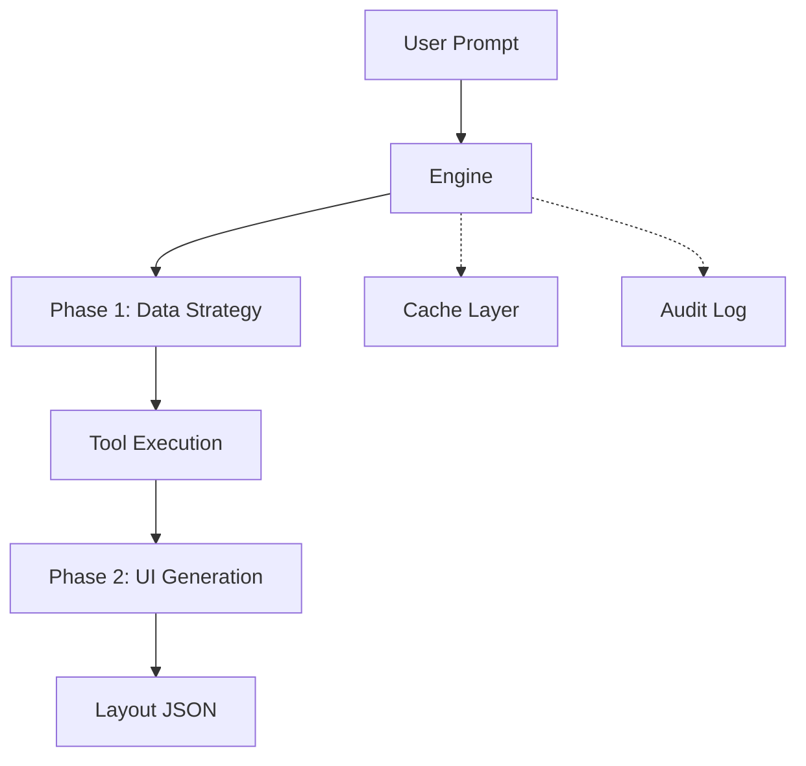

**@ferroui/engine**

***

# @ferroui/engine

The Orchestration Engine is the brain of FerroUI. It translates user prompts into high-fidelity layout JSON using a Dual-Phase Pipeline powered by Large Language Models (LLMs).

## Architecture



## Features

- **Dual-Phase Pipeline**: Separates data retrieval from UI generation for maximum reliability.
- **Provider-Agnostic**: Supports OpenAI, Anthropic, Google, Ollama, and more.
- **Auto-Repair**: Automatically attempts to fix invalid layouts during generation.
- **OpenTelemetry**: Integrated tracing for every stage of the pipeline.

## Installation

```bash
pnpm add @ferroui/engine
```

## Usage

### Creating an Engine Instance

```typescript
import { FerroUIEngine } from '@ferroui/engine';
import { OpenAIProvider } from '@ferroui/engine/providers/openai';

const provider = new OpenAIProvider({ apiKey: process.env.OPENAI_API_KEY });
const engine = new FerroUIEngine(provider);
```

### Processing a Prompt

```typescript
const prompt = "Show me a sales dashboard";
const context = { userId: '123', requestId: 'req-456', locale: 'en-US' };

for await (const chunk of engine.process(prompt, context)) {
  if (chunk.type === 'layout_chunk') {
    console.log('Received layout:', chunk.layout);
  }
}
```

## Configuration

- `maxRepairAttempts`: Number of times the engine tries to fix an invalid layout (default: 3).
- `cacheEnabled`: Whether to cache engine results (default: true).
- `toolTimeoutMs`: Timeout for backend tool execution (default: 3000ms).

## API Reference

- `FerroUIEngine`: Main orchestration class.
- `LlmProvider`: Abstract base class for LLM providers.
- `runDualPhasePipeline`: The core processing function.
