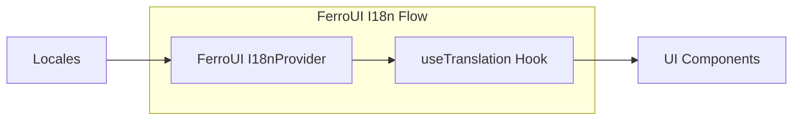

**@ferroui/i18n**

***

# @ferroui/i18n

Internationalization and localization utilities for FerroUI.



## Installation

```bash
pnpm add @ferroui/i18n
```

## Usage

### Provider Setup

```tsx
import { I18nProvider } from '@ferroui/i18n';

const locales = {
  'en-US': { common: { welcome: 'Welcome to FerroUI' } },
  'es-ES': { common: { welcome: 'Bienvenido a FerroUI' } }
};

export function App() {
  return (
    <I18nProvider locale="en-US" locales={locales}>
      <Welcome />
    </I18nProvider>
  );
}
```

### Hook Usage

```tsx
import { useTranslation } from '@ferroui/i18n';

export function Welcome() {
  const { t } = useTranslation('common');
  return <h1>{t('welcome')}</h1>;
}
```

## API Reference

- `useTranslation`: Hook for component translation.
- `I18nProvider`: Context provider for i18n state.
- `formatDate`, `formatNumber`: Intl-based formatting helpers.

## Configuration

Managed via `I18nProvider` props.

## Examples

```tsx
const { t } = useTranslation('common');
return <span>{t('welcome')}</span>;
```
