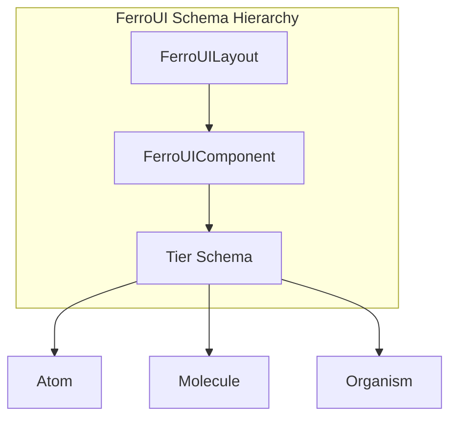

**@ferroui/schema**

***

# @ferroui/schema

Zod-based schemas and TypeScript types for the FerroUI layout system.



## Installation

```bash
pnpm add @ferroui/schema
```

## Usage

```typescript
import { FerroUILayoutSchema, type FerroUILayout } from '@ferroui/schema';

const rawData = {
  version: '1.0',
  components: [
    { id: 'btn-1', type: 'button', tier: 'atom', props: { label: 'Click me' } }
  ]
};

// Validate and parse
const result = FerroUILayoutSchema.safeParse(rawData);

if (result.success) {
  const layout: FerroUILayout = result.data;
  console.log('Layout is valid!');
} else {
  console.error('Validation failed:', result.error.format());
}
```

## API Reference

- `FerroUILayoutSchema`: Zod schema for the root layout.
- `FerroUIComponentSchema`: Zod schema for components.
- `ComponentTier`: Enum for Atomic Design tiers.

## Configuration

N/A

## Examples

```typescript
const result = validateLayout(jsonInput);
if (result.valid) { ... }
```
