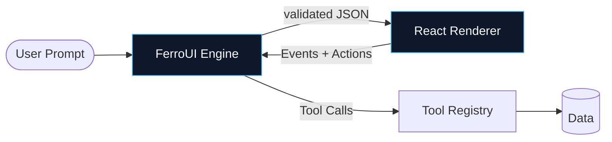

# Introduction

FerroUI is a **server-driven UI (SDUI) meta-framework** designed from first principles for **AI-native applications**. Large language models produce validated `FerroUILayout` JSON from a typed registry of components and tools. A deterministic renderer materializes that JSON as React — with i18n, RTL, state machines, and an action router built in.

This page gives you just enough context to navigate the rest of the documentation. For a hands-on path, jump straight to the [Quickstart](/dev-experience/Quickstart_Developer_Onboarding).

---

## Why Server-Driven UI?

Traditional LLM UI integrations hit three failure modes:

1. **Free-form hallucinated JSX** — unsafe, unstyled, untestable.
2. **Raw tool-use with chat UI** — fine for support bots, not for dashboards.
3. **Hand-authored templates** — every new use case is a new PR.

FerroUI inverts the problem. The LLM is constrained to a **finite, validated grammar**: the `FerroUILayout` schema. The grammar is expressive enough to describe dashboards, forms, wizards, and conversational surfaces. But it cannot produce anything the renderer cannot safely materialize.

---

## Core Primitives

| Primitive | Responsibility | Docs |
|-----------|----------------|------|
| **`FerroUILayout`** | The JSON contract between the engine and renderer | [Schema Spec](/engineering/backend/FerroUILayout_JSON_Schema_Specification) |
| **Component Registry** | Typed atoms, molecules, organisms with Zod schemas | [Components API](/api/components) |
| **Tool Registry** | Permission-gated backend integrations | [Tools API](/api/tools) |
| **Action Router** | State machine & event dispatch layer | [System Architecture](/architecture/System_Architecture_Document) |
| **Semantic Cache** | Embedding-based layout cache with invalidation | [Caching Strategy](/engineering/backend/Semantic_Caching_Strategy_Invalidation) |

---

## Reading Order by Persona

- **New developer, want a working app →** [Quickstart](/dev-experience/Quickstart_Developer_Onboarding) then [Build a Component](/engineering/frontend/Component_Development_Guidelines).
- **Platform engineer, evaluating for production →** [System Architecture](/architecture/System_Architecture_Document), [ADRs](/architecture/ADRs/), [Security Threat Model](/security/Security_Threat_Model).
- **Security / compliance lead →** [Threat Model](/security/Security_Threat_Model), [Compliance Matrix](/compliance/Compliance_Matrix), [SOC 2 Readiness](/compliance/SOC2_Readiness_Checklist).
- **SRE / DevOps →** [Observability Dictionary](/ops/Observability_Telemetry_Dictionary), [Runbooks](/ops/Runbooks_Incident_Response), [DR Plan](/ops/Disaster_Recovery_Business_Continuity).
- **Product →** [PRDs](/product/PRDs/), [Personas](/product/User_Personas_Developer_Journeys), [Competitor Matrix](/product/Competitor_Feature_Matrix).

---

## Versioning & Stability

- **Current version:** `v1.0 — Stable`
- **Schema versioning:** The `FerroUILayout` contract is versioned via Changesets. Breaking schema changes require an RFC. See [ADR-008 Forward Compatibility](/architecture/ADRs/ADR-008-Forward-Compatibility-Strategy).
- **Component registry:** Each component has a `version: number` field. Breaking prop changes bump the version. See [ADR-004 Registry Versioning](/architecture/ADRs/ADR-004-Component-Registry-Versioning).

---

## License

FerroUI is released under the [MIT License](/meta/license). See the [OSS Licensing Matrix](/security/Open_Source_Licensing_Dependency_Matrix) for the full dependency ledger.
