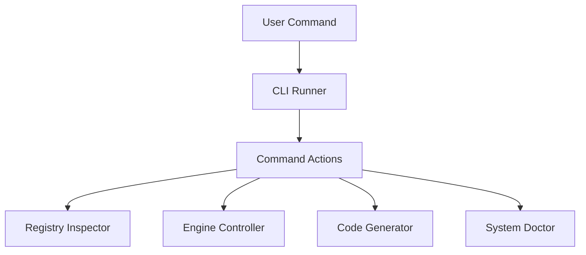

# @ferroui/cli

The FerroUI CLI is the Swiss Army knife for developers building applications with the FerroUI ecosystem. It provides scaffolding, system health checks, and orchestration management.

## Architecture



## Features

- **Command-Line Interface**: Simple, human-friendly commands for common tasks.
- **Dynamic Scaffolding**: Generate boilerplate for components and tools using pre-built templates.
- **System Doctor**: Validates the local environment, dependencies, and configuration.
- **Registry Inspection**: CLI-based tools for exploring the registered components and their schemas.

## Installation

```bash
# Global install
npm install -g @ferroui/cli

# Project-level install
pnpm add -D @ferroui/cli
```

## Usage

### Create a New App

```bash
ferroui create my-new-app
```

### Run the Development Server

```bash
ferroui dev
```

### Check System Health

```bash
ferroui doctor
```

### Generate a Component

```bash
ferroui generate component MyOrganism
```

## API Reference

The CLI is primarily used as a binary, but its internal command handlers are also available as modules.
