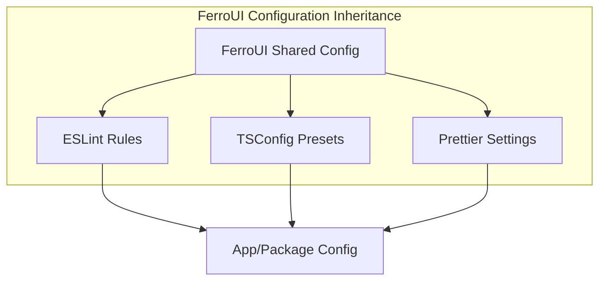

# @ferroui/config

Shared configuration (ESLint, TypeScript, Prettier) for FerroUI.



## Installation

```bash
pnpm add -D @ferroui/config
```

## Usage

### ESLint

Extend the shared config in your `eslint.config.js` or `.eslintrc.json`:

```javascript
// eslint.config.js
import { eslint } from '@ferroui/config';

export default [
  ...eslint.base,
  {
    rules: {
      // Local overrides
    }
  }
];
```

### TypeScript

Extend the shared config in your `tsconfig.json`:

```json
{
  "extends": "@ferroui/config/typescript/base.json",
  "compilerOptions": {
    "outDir": "./dist"
  }
}
```

## API Reference

- `eslint`: Base ESLint configuration.
- `typescript`: Base tsconfig for apps and packages.
- `prettier`: Shared Prettier rules.

## Configuration

N/A

## Examples

```json
// .eslintrc.json
{
  "extends": "@ferroui/config/eslint"
}
```
