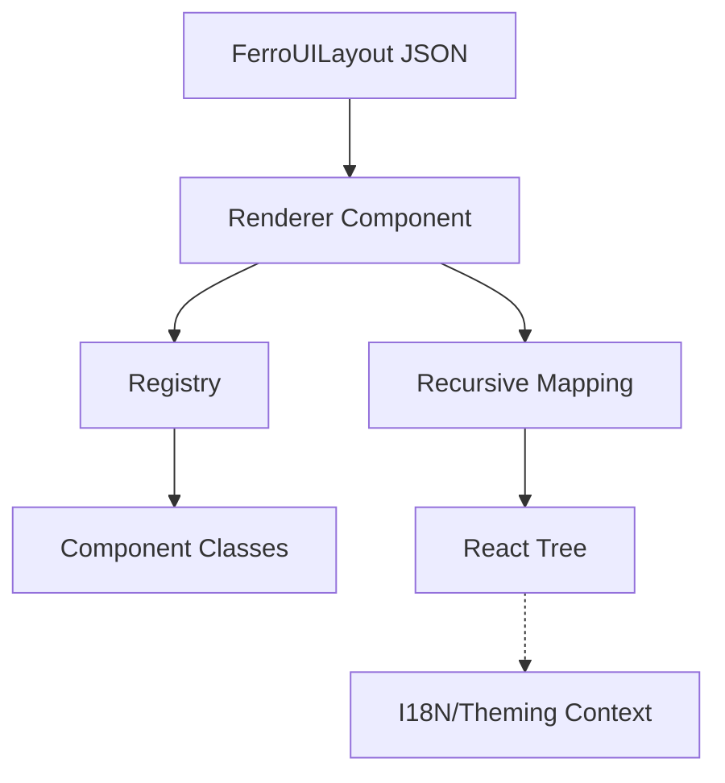

# @ferroui/renderer

The High-Fidelity Renderer is responsible for transforming a `FerroUILayout` JSON structure into a responsive, interactive React application. It uses the `ComponentRegistry` to dynamically instantiate components.

## Architecture



## Features

- **Recursive Rendering**: Deeply nested layouts are rendered with full hierarchy support.
- **Dynamic Registry Binding**: Components are retrieved from the registry at runtime.
- **Safe Mode Rendering**: Provides a fallback layout when the engine fails or a component is missing.
- **SSR/Hydration Support**: Fully compatible with modern React patterns for server-side rendering.

## Installation

```bash
pnpm add @ferroui/renderer
```

## Usage

### Rendering a Layout

```tsx
import { FerroUIRenderer } from '@ferroui/renderer';

const myLayout = {
  type: 'Dashboard',
  props: { title: 'Hello World' },
  children: []
};

function App() {
  return (
    <FerroUIRenderer layout={myLayout} />
  );
}
```

### Advanced Props Handling

The renderer automatically handles:
- **`aria` merging**: Combines schema-defined accessibility with dynamic props.
- **`ref` forwarding**: Every rendered component receives a ref for DOM access.

## API Reference

- `FerroUIRenderer`: The main React component for rendering layouts.
- `renderComponent(node)`: Recursive helper for mapping JSON to React elements.
