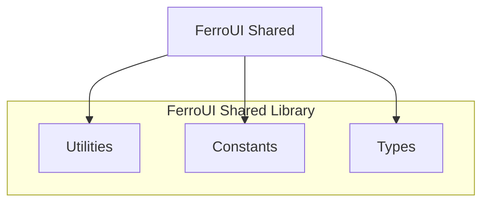

# @ferroui/shared

Shared utilities, types, and constants for FerroUI.



## Installation

```bash
pnpm add @ferroui/shared
```

## Usage

```typescript
import { deepMerge, type AnyMap } from '@ferroui/shared';

const base = { a: 1, b: { c: 2 } };
const override = { b: { d: 3 } };

const merged = deepMerge(base, override);
// { a: 1, b: { c: 2, d: 3 } }
```

## API Reference

Varies by module.

## Configuration

N/A

## Examples

```typescript
import { deepMerge } from '@ferroui/shared';
```
