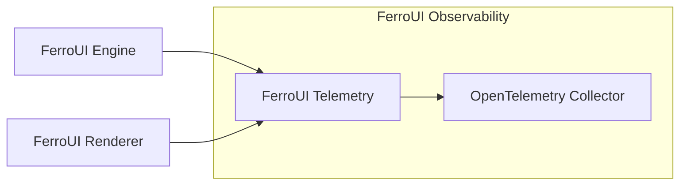

# @ferroui/telemetry

Telemetry and observability utilities for FerroUI, integrating OpenTelemetry for tracing and metrics.



## Installation

```bash
pnpm add @ferroui/telemetry
```

## Usage

```typescript
import { tracer, ferrouiMetrics, withSpan } from '@ferroui/telemetry';

// Tracing Example
await withSpan('my-operation', async (span) => {
  // perform logic
  span.setAttribute('component', 'renderer');
});

// Metrics Example
ferrouiMetrics.counter('my_counter', { description: 'Counts something' }).add(1);
```

## API Reference

- `initializeTelemetry`: Setup OTel SDK.
- `tracer`, `ferrouiMetrics`, `logger`: Core instrumentation instances.
- `withSpan`, `withLlmCall`, `withToolCall`: Instrumentation wrappers.

## Configuration

Configured via environment variables (e.g., `OTEL_EXPORTER_OTLP_ENDPOINT`).

## Examples

```typescript
await withSpan('my-task', async (span) => { ... });
```
